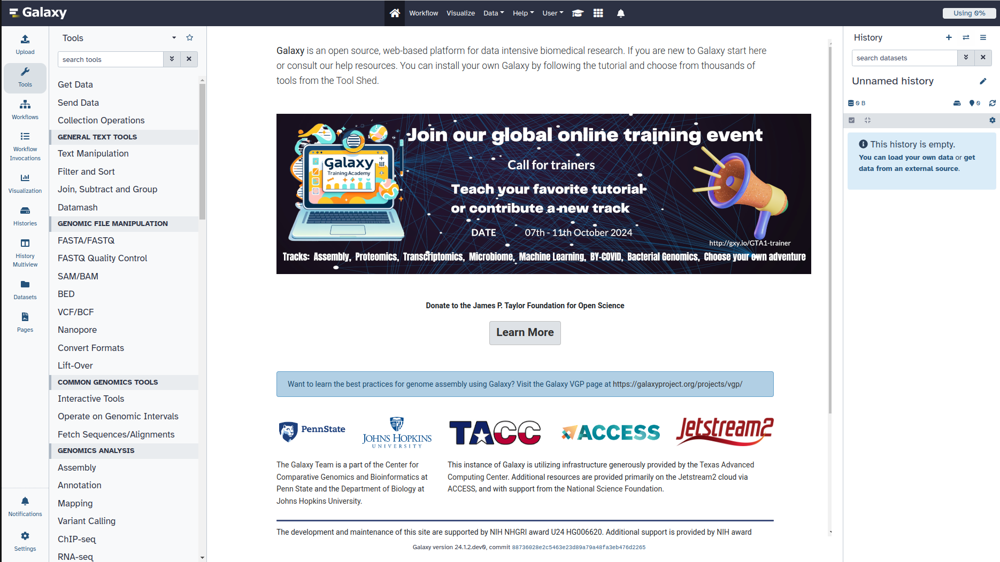
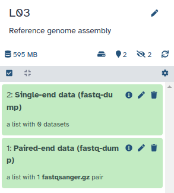

<h1 align="center">
<b>Activity</b><br>
Quality control
</h1>

TODO:

## Get sequencing reads

In this section, we'll download raw Illumina sequencing reads from the Sequence Read Archive (SRA) and explore their basic characteristics using Galaxy.

### Accessing Galaxy

Open a web browser and go to [usegalaxy.org](https://usegalaxy.org/)
If you don't have an account, create one by clicking on "Login or Register" at the top.

!!! quote "Figure"
    You should see something like this.

    <figure markdown>
    
    </figure>

### Downloading reads from SRA

In the Galaxy **Tools** panel on the left, click `Get Data` and select the "**Download and extract reads in FASTQ** format from NCBI SRA" tool.

!!! quote "Figure"
    <figure markdown>
    
    </figure>

This tool allows you to download available data from the [SRA](https://www.ncbi.nlm.nih.gov/sra).
Often, we are analyzing data mentioned in a publication that will provide you with an accession number either for the SRA or BioProject.
In our case, we will use the whole genome sequencing of *Staphylococcus aureus* at [`SRR14933407`](https://www.ncbi.nlm.nih.gov/sra/?term=SRR14933407).
In the "**Accession**" field, enter the following SRA accession number: `SRR14933407`.
Leave other options as default and click "**Run Tool**" in the top right.
This will start downloading the raw reads in FASTQ format.

!!! tip
    This will take a few minutes to run and will be yellow.

Once the download is finished, you will see two green boxes:

-   one for single-ended reads, and
-   one for pair-ended reads.

!!! quote "Figure"
    <figure markdown>
    
    </figure>

Our SRA data only contains pair-ended reads, meaning we have forward and reverse reads from Illumina.
If you click on the little information icon, Galaxy will show us job information.

!!! quote "Figure"
    <figure markdown>
    
    </figure>

Notably, it provides us the bash commands used for the job.

```sh
# Create accessions file
echo 'SRR14933407' | sed -r 's/(\,|\;|__cn__)/\n/g' > accessions

# Process each accession
for acc in $(cat ./accessions); do
    echo "Downloading accession: $acc..."

    # Download and extract fastq files
    prefetch -X 200000000 "$acc"
    fastq-dump --accession "$acc" \
               --split-files \
               --defline-seq '@$ac.$sn[_$rn]/$ri' \
               --defline-qual '+' \
               --split-spot \
               --gzip

    # Create output directory and move files
    mkdir -p output
    data=($(ls ./*.fast*))
    if [ ${\#data[@]} -eq 2 ]; then
        mv "${data[0]}" output/"${data[0]}"_forward.fastqsanger.gz
        mv "${data[1]}" output/"${data[1]}"_reverse.fastqsanger.gz
    elif [ ${\#data[@]} -eq 1 ]; then
        mv "${data[0]}" output/"${data[0]}"__single.fastqsanger.gz
    fi
done

echo "Done with all accessions."
```

<!--
1. Examining the FASTQ files:
   - Once the download is complete, you'll see two datasets in your history panel on the right: one for forward reads (R1) and one for reverse reads (R2).
   - Click on the eye icon next to each file to preview its contents.
   - Observe the four lines that make up each sequencing read:
     1. Sequence identifier (starts with @)
     2. The actual DNA sequence
     3. A separator line (usually just a +)
     4. Quality scores (encoded as ASCII characters)

2. Getting basic statistics:
   - In the tool panel, search for "FastQC" and click on it.
   - Select both R1 and R2 files as inputs.
   - Click "Execute" to run FastQC on both files.

3. Interpreting FastQC results:
   - Once FastQC completes, click on the eye icon to view the HTML report.
   - Examine key metrics such as:
     a. Basic Statistics: Total sequences, sequence length, %GC
     b. Per base sequence quality: Look for any drop in quality towards the end of reads
     c. Per sequence quality scores: Overall distribution of quality scores
     d. Sequence Length Distribution: Should be uniform for raw data
     e. Overrepresented sequences: May indicate adapter contamination

4. Understanding quality scores:
   - Quality scores are encoded in Phred+33 format.
   - The ASCII characters represent quality scores from 0 to 40.
   - Generally, scores above 28 are considered good quality.

5. Identifying potential issues:
   - Look for any warnings or failures in the FastQC report.
   - Common issues include:
     - Low quality bases at the end of reads
     - Overrepresented sequences (possible adapter contamination)
     - Abnormal GC content distribution
 -->
