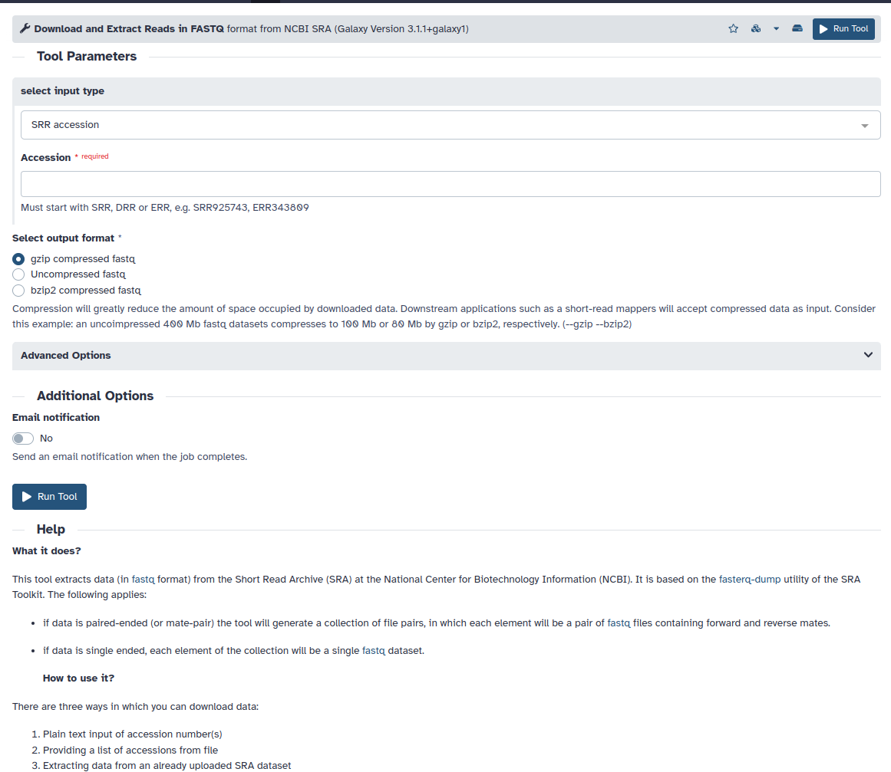
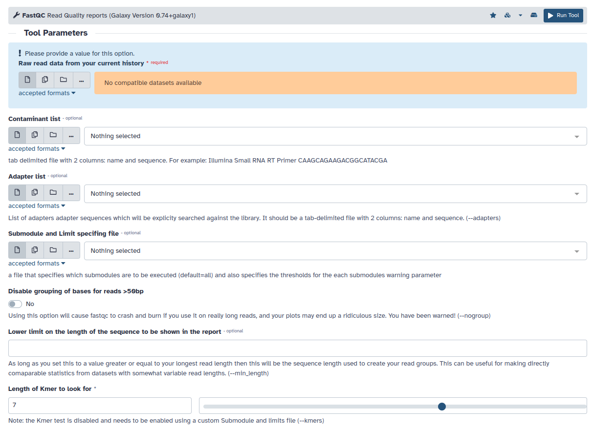

<h1 align="center">
<b>Activity</b><br>
Quality control
</h1>

During sequencing, errors are introduced, such as incorrect nucleotides being called.
These are due to the technical limitations of each sequencing platform.
Sequencing errors might bias the analysis and can lead to a misinterpretation of the data.
Adapters may also be present if the reads are longer than the fragments sequenced and trimming these may improve the number of reads mapped.
Sequence quality control is therefore an essential first step in any analysis.

Assessing the quality by hand would be too much work.
That’s why tools like [NanoPlot](https://github.com/wdecoster/NanoPlot) or [FastQC](https://www.bioinformatics.babraham.ac.uk/projects/fastqc/) are made, as they generate a summary and plots of the data statistics.
NanoPlot is mainly used for long-read data, like ONT and PACBIO and FastQC for short read, like Illumina and Sanger.

## Get sequencing reads

In this section, we'll download raw Illumina sequencing reads from the Sequence Read Archive (SRA) and explore their basic characteristics using Galaxy.

### Accessing Galaxy

Open a web browser and go to [usegalaxy.org](https://usegalaxy.org/)
If you don't have an account, create one by clicking on "Login or Register" at the top.

!!! quote "Figure"
    You should see something like this.

    <figure markdown>
    
    </figure>

### Downloading reads from SRA

In the Galaxy **Tools** panel on the left, click `Get Data` and select the "**Download and extract reads in FASTQ** format from NCBI SRA" tool.

!!! quote "Figure"
    <figure markdown>
    
    </figure>

This tool allows you to download available data from the [SRA](https://www.ncbi.nlm.nih.gov/sra).
Often, we are analyzing data mentioned in a publication that will provide you with an accession number either for the SRA or BioProject.
In our case, we will use the whole genome sequencing of *Staphylococcus aureus* at [`SRR14933407`](https://www.ncbi.nlm.nih.gov/sra/?term=SRR14933407).
In the "**Accession**" field, enter the following SRA accession number: `SRR14933407`.
Leave other options as default and click "**Run Tool**" in the top right.
This will start downloading the raw reads in FASTQ format.

!!! tip
    This will take a few minutes to run and the color will be <span style="background-color:#FFE6CD">Blanched Almond</span>.
    (Yes, I looked up the name.)

Once the download is finished, you will see two green boxes:

-   one for single-ended reads, and
-   one for pair-ended reads.

!!! quote "Figure"
    <figure markdown>
    
    </figure>

Our SRA data only contains pair-ended reads, meaning we have forward and reverse reads from Illumina.
If you click on the little information icon, Galaxy will show us job information.

!!! quote "Figure"
    <figure markdown>
    
    </figure>

Notably, it provides us the bash commands used for the job.

```sh
# Create accessions file
echo 'SRR14933407' | sed -r 's/(\,|\;|__cn__)/\n/g' > accessions

# Process each accession
for acc in $(cat ./accessions); do
    echo "Downloading accession: $acc..."

    # Download and extract fastq files
    prefetch -X 200000000 "$acc"
    fastq-dump --accession "$acc" \
               --split-files \
               --defline-seq '@$ac.$sn[_$rn]/$ri' \
               --defline-qual '+' \
               --split-spot \
               --gzip

    # Create output directory and move files
    mkdir -p output
    data=($(ls ./*.fast*))
    if [ ${\#data[@]} -eq 2 ]; then
        mv "${data[0]}" output/"${data[0]}"_forward.fastqsanger.gz
        mv "${data[1]}" output/"${data[1]}"_reverse.fastqsanger.gz
    elif [ ${\#data[@]} -eq 1 ]; then
        mv "${data[0]}" output/"${data[0]}"__single.fastqsanger.gz
    fi
done

echo "Done with all accessions."
```

You can see a preview of the raw reads by clicking on "Paired-end data" box, select SRR14933407, and then click on the <span class="material-symbols-outlined">visibility</span> on either "forward" or "reverse".
This will show you the first megabyte of the file, we only provide the first two forward-read sequences.

```text
@SRR14933407.1/1
TGTAGGTGTTACAATCTTGCCAGAAATCATGATGAAAAATATCAGCAAAGAACAATTTGAGTTTGAAAAAGTAGAAATTGATAATGAACCGCTGATTCGTTCGACATTTATGAGTTATGATCCGAGTATGTTGCAATTACCACAAGTTGATTCATTTGTAAATCTTATGACGAGCTTTGTTGAAGAACCAAAGGCGTAGTCTTAGACTAATTTAAGGTTAGTATTTAATTTTAAAGATCGGAAGAGCACAC
+
DDDDDIIIHIIIIIIHIIIIHIIIGIIIIIIIIIIHHHIIIHIIIIIIHIHHIGFIIIIIIHHIIIIIIIIHHIIIIE<DFHHIIIHHIEHCHIIIIIIIHHHHIIHHIIIIFIIIIIIIIIIIIIIIIIIHIIIIIIIIIHIIIIHIIHIIHHIIIIIIIIIIHIIHHIIGIIGIHIHHHHGIIIIIIIIHIHIIIIIIIGIIHHIIIHIHHG@GHGCGHHHHIIIHHIIH?HGCEGH?EHHIHEHIFH@
@SRR14933407.2/1
CTAGAAATATTGATTTATTGCATGTATAATGTTAAAAGTGCCCTTTTATAACGCTTACATATAAAAGCTTATTTAGGGAGAGGGATATTCAACAAGGGGGATTTGAAAATGATAGAACTTAATGCAATTACAACATTATGTTTAGCCTGTATACTTTACTTACTTGGTAAAGCTATCGTTAATCACGTTAATTTTTTAAAACGCATTTGTATACCAGCACCAGTGATTGGTGGCTTAATCTTTGCTATTTT
+
DDDDAIIHIIHIHIHIIIIIIIIIIIIIIIIIIFGHIIIIIIFIIIIIIIIIIIIIIHIGHHIGHIIIEHIIIHIHHIDHHHGIIIIIIIIHIHHHFHHHCEHHIIIIGHCHHHHIIIIIIIIIHIIIIIIIIIHIHIIIIHIHIIIIIIHIHHHIIHIHIIIIIIHIIIIIIIHHHIIHIGHHHIIIIIIIIHIIIHIIIIIHHGIHIIFHHGEHIIHEHIIIIHICHHHHC??HHAGEEHHHEHHIIII
```

TODO: Contains the DNA read and the quality scores.

## Running FastQC

!!! quote "Figure"
    <figure markdown>
    
    </figure>

Under "Raw read data from your current history", click the "Dataset collection" option, <span class="material-symbols-outlined">folder</span>, select our "Paired-end data", and then hit "Run tool".

!!! quote "Figure"
    <figure markdown>
    
    </figure>

You will be given two collections of data on the right.
We want to look at the "FastQC on collection 1: Webpage" <a href="./fastqc_forward_initial.html" target="blank">forward</a> and <a href="./fastqc_reverse_initial.html" target="blank">reverse</a>.
These reports contain a bunch of useful information, but we generally check a few things first.
Please read the [FastQC report guide](https://omics.crumblearn.org/genomics/assembly/qc/fastqc/analysis/) for plot explanations.

## Trim and filter

The quality drops in the middle of these sequences.
This could cause bias in downstream analyses with these potentially incorrectly called nucleotides. Sequences must be treated to reduce bias in downstream analysis.
Trimming can help to increase the number of reads the aligner or assembler are able to successfully use, reducing the number of reads that are unmapped or unassembled. In general, quality treatments include:

1.  Trimming/cutting/masking sequences
    -   from low quality score regions
    -   beginning/end of sequence
    -   removing adapters
2.  Filtering of sequences
    -   with low mean quality score
    -   too short
    -   with too many ambiguous (N) bases

To accomplish this task we will use [Cutadapt](https://cutadapt.readthedocs.io/en/stable/index.html), a tool that enhances sequence quality by automating adapter trimming as well as quality control.
